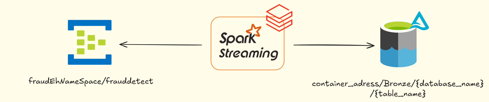
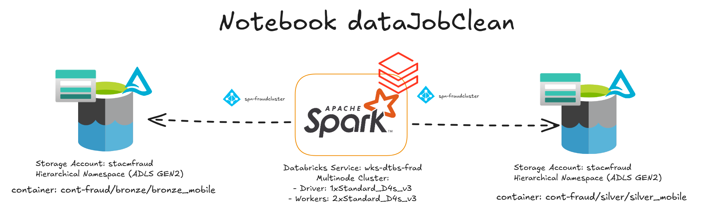
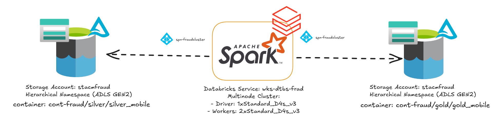
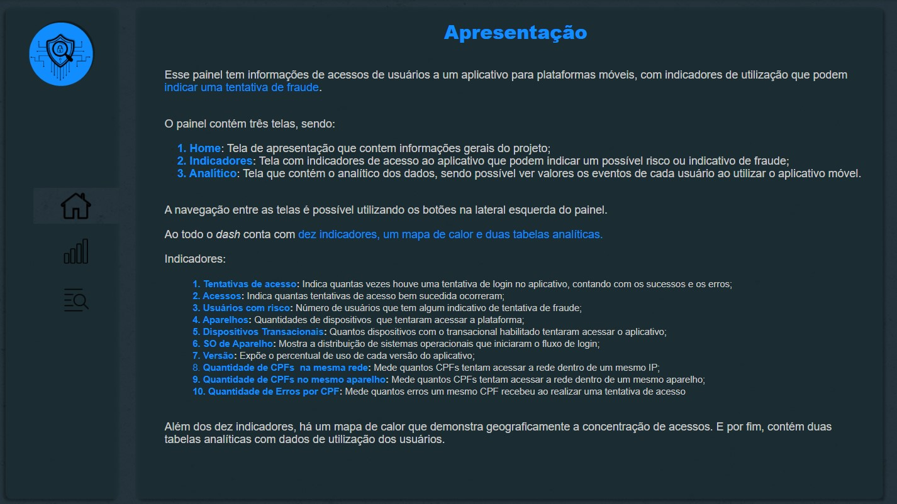
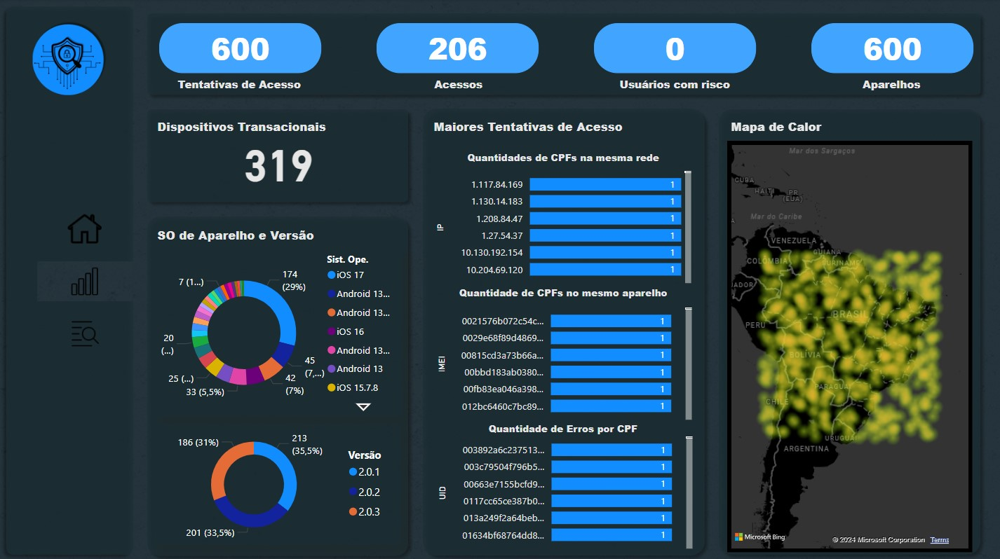
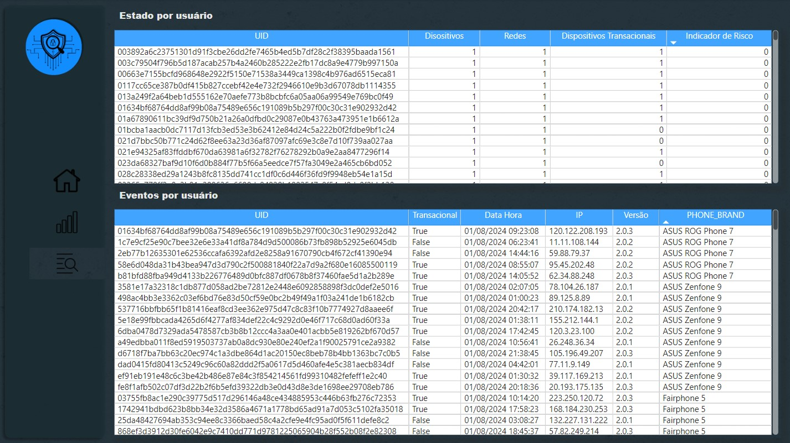

# Mobile Fraud Detect Solution - Identificando Tentativas de Fraudes em Aplicativos Mobile

## I. Resumo e Objetivo do Case

Fraudes em logins de aplicativos de transações financeiras têm se tornado cada vez mais sofisticadas, especialmente em dispositivos móveis. Uma das práticas mais comuns é o Account Takeover (ATO), que ocorre quando invasores conseguem acesso não autorizado a uma conta legítima, muitas vezes utilizando técnicas de engenharia social, phishing, ou através da forma mais básica desse tipo de ataque, que envolve ataques de força bruta orientados por bots, que enviam combinações aleatórias de caracteres a formulários de login até encontrar a combinação de credenciais da conta.

No contexto de um aplicativo de transações financeiras, como o desenvolvido neste case, os invasores podem utilizar informações pessoais (como CPF, IMEI, MAC address ou dados de localização) para simular que estão usando um dispositivo autenticado. Através de login com credenciais roubadas, eles tentam executar transações fraudulentas, transferindo fundos ou acessando informações sensíveis.

Os padrões de comportamento são cruciais para detectar account takeover. Entre os sinais de alerta estão:

- Logins repetidos a partir de múltiplos dispositivos desconhecidos.
- Alterações frequentes de localizações geográficas.
- Uso de dispositivos diferentes do habitual para um CPF específico.
- Discrepâncias entre a versão do sistema operacional ou da aplicação usada nos logins.
- Várias tentativas de login malsucedidas em curto intervalo de tempo.

A solução proposta neste case utiliza um fluxo robusto de ingestão de dados em tempo real, onde informações de login e do aparelho são enviados para um data lake na cloud, estas podem alimentar times de prevenção e detecção de fraudes. Com posse deses dados, é possível indentificar padrões e comportamentos suspeitos em dados históricos para retiradas de insights que podem apresentar tanto tentativas de fraudes "silenciosas", quanto auditoria de possíveis casos de ATO com sucesso.

Desta forma, este trabalho tem como objetivo implementar um case prático de coleta de logs de acesso a um aplicativo de transações financeiras, onde a arquitetura contém ingestão e transformação e visualização de dados em um data lake na cloud (Azure Data Lake Gen2).

## II. Arquitetura de Solução e Arquitetura Técnica

Existem diversas estratégias para mitigar e resolver problemas de tentativas de fraude em sistemas Mobile e Web, desde estratégias de conscientização dos usuários a soluções Anti-Bot, onde para escolher e avaliar a estratégia mais assertiva é importante que os setores de riscos e fraudes consigam identificar e entender quais as principais carateríticas do perigo eminente. A coleta e avaliação de logs de aplicação como ilustrado na Figura 1 com soluções de monitoramento ou dados auxilia o profissional de fraudes neste fluxo de escolha de estratégias de proteção e melhoria.

<p align="center">
  
  <br>
  <em>Figura 1: Arquitetura funcional de ingestão e transformação de dados para tomada de decisão</em>
</p>

  A Figura 2 apresenta a arquitetura técnica de funcionamento para ingestão e transformação de dados coletados de uma sistema de login para aplicativos móveis.

<p align="center">
  
  <br>
  <em>Figura 2: Arquitetura para ingestão e transformação de dados em um data lake na Azure</em>
</p>

Para a ingestão foi escolhido o Eventhub com *SKU Basic* por ter o menor custo, como não é possível utilizar o *capture* para consumo dos dados do eventhub, e visando garantir que não haverá perca das mensagens devido ao intervalo de retenção do *SKU Basic* (um dia) uma solução com spark streaming para ingestão dos dados em uma camada Bronze torna-se uma opção viável.

Na camada de processamento é possível utilizar o Databricks para realizar a ingestão e transformação dos dados garantindo segurança já que a solução envolve dados sensíveis de usuários, escalabilidade visto que geralmente aplicativos de transações financeiras atendem a milhares de usuários e existe forte sazonalidade, onde em alguns momentos é necessário um maior poder computacional, e por fim, eficiência já que conta com uma série de recursos que ajudam a otimizar os processos, como o *Adaptive Query Execution - AQE*, *Optimization*, *Z-Order* e diversos outros recursos que ajudam a reduzir custos. 

Para ser possível sincronizar as *secrets* armazenadas no Azure Key Vault e garantir a segurança para leitura e escrita e permitindo anonimização dos dados de forma eficiente é necessário o provisionamento do Databricks *Workspace Premium* já que este permite a sincronização do *scope* com o *AKV*. 

O *AKV* permite o armazenamentodos segredos das *Service Principals (SPNs)* para que as aplicações de ingestão e transformação de dados consigam resgatar os valores de forma segura.

Para processamento dos dados o tipo de instância escolhida para o Driver e os Workers foi o Standard_D4s_v3, que é otimizada para cargas de trabalho gerais (já que neste case é utilizado o mesmo cluster para ingestão e transformação de dados) com um bom equilíbrio entre CPU (4 vCPUs), memória (16 GB de RAM) e capacidade de armazenamento (32 GB SSD).

Com foco em armazenamento de grande volume de dados e com suporte nativo ao *Hadoop Distributed File System (HDFS)* facilitando a integração com ferramentas de big data como Apache Spark, Databricks e outras, o *ADLS Gen2* é uma das melhores escolhas. Contando também com camada de armazenamento hierarquico o que permite melhor desempenho ao acessar grandes quantidades de dados organizados em diretórios, o que é muito útil ao se adotar uma arquitetura de dados medalhão. Outra grande vantagem da utilização do *ADLS Gen2* é o suporte para criptografia de dados com chave gerenciada pelo cliente.

Por fim, como estratégia de monitoramento foi utilizado o Azure Monitor por simplicidade, por ser uma ferramenta nativa da Azure, não sendo necessário realizar grandes configurações para coletar métricas de funcionamento da solução.
 
## III. Explicação sobre o case desenvolvido

O processo de ingestão e transformação dos dados desta solução caracteriza uma arquitetura Lambda, já que, como explicado anteriormente a solução streaming é utilizada para garantir que não exista perca das mensagens por expiração das mesmas no eventhub, e para processamento das camadas silver e gold os jobs foram desenvolvidos para terem um fluxo batch com uma execução por dia.

Para ser possível replicar a infra deste trabalho é necessário uma assinatura do provedor de cloud Azure, um grupo de recursos e o provisionamento dos seguintes recursos: *Eventhub Namespace* básico, *Azure Key Vault* Padrão, *Storage Account* com *Namespace* hierárquico e Databricks *Workspace Premium*. Afim de facilitar o provisionamento da infraestrutura, disponibilizo aqui o [script.sh](https://github.com/Foiac/MobileFraudDetectSolution/blob/main/Infraestrutura/script.sh) para disponibilização dos recursos citados anteriormente.

### _Cluster Databricks e Scope_

Como descrito na seção de arquitetura, é necessário a criação de um cluster, a seguir é disponibilizado o json para facilitar o provisionamento, basta substituir [my-storage-account-name] pelo nome do recurso ADLS provisionado, [my-spn-client-id] pelo *client id* da SPN criada no AAD e o [my-tenant-id] pelo *tenant id* da assinatura.

``` JSON
{
    "cluster_name": "fraud-cluster",
    "spark_version": "13.3.x-scala2.12",
    "spark_conf": {
        "spark.hadoop.fs.azure.account.oauth2.client.secret.[my-storage-account-name].dfs.core.windows.net": "{{secrets/dbwsscope/spn-secret}}",
        "spark.hadoop.fs.azure.account.oauth2.client.id.[my-storage-account-name].dfs.core.windows.net": "[my-spn-client-id]",
        "spark.hadoop.fs.azure.account.auth.type.[my-storage-account-name].dfs.core.windows.net": "OAuth",
        "spark.hadoop.fs.azure.account.oauth.provider.type.[my-storage-account-name].dfs.core.windows.net": "org.apache.hadoop.fs.azurebfs.oauth2.ClientCredsTokenProvider",
        "spark.hadoop.fs.azure.account.oauth2.client.endpoint.[my-storage-account-name].dfs.core.windows.net": "https://login.microsoftonline.com/[my-tenant-id]/oauth2/token"
    },
    "azure_attributes": {
        "first_on_demand": 1,
        "availability": "SPOT_WITH_FALLBACK_AZURE",
        "spot_bid_max_price": -1
    },
    "node_type_id": "Standard_D4s_v3",
    "driver_node_type_id": "Standard_D4s_v3",
    "autotermination_minutes": 30,
    "enable_elastic_disk": true,
    "enable_local_disk_encryption": false,
    "runtime_engine": "STANDARD",
    "effective_spark_version": "11.3.x-scala2.12",
    "autoscale": {
        "min_workers": 2,
        "max_workers": 2
    },
    "apply_policy_default_values": false
}
```

Como nas configurações do spark é referenciado uma variável para consumo da secret do Scope do datrabricks, é necessário realizar cerimônia de senha para inserir a secret da *Service Principal* criada no AKV e sincronizar o mesmo com o scope criado no Databricks. O processo de criação e sincronização pode ser consultado na [documentação da Azure](https://learn.microsoft.com/pt-br/azure/databricks/security/secrets/secret-scopes).

Para o cluster foi utilizado a versão Databricks Runtime [13.3](https://learn.microsoft.com/pt-br/azure/databricks/release-notes/runtime/13.3lts) que conta com a versão 3.4.1 do Apache Spark sendo uma versão robusta e estável.

### _Ingestão `Bronze`_

Todo o desenvolvimento deste trabalho se concentra na solução de ingestão e transformação de dados, abordando e utilizando técnicas de Engenharia de Dados, assim, o desenvolvimento da ingestão de dados no Eventhub foi implementado através de um notebook python que mocka os dados e realiza o envio dos dados para o broker de mensageria através do protocolo AMQP, utilizando uma Service Principal com *role* apenas de envio de dados, onde o notebook desenvolvido para esta solução é encontrado seguindo o [link](https://github.com/Foiac/MobileFraudDetectSolution/blob/main/dev-notebooks/0%20-%20mockData/generateMockData.ipynb). O processo de envio dos dados para o tópico do eventhub é possível através da utilização dos pacotes [`azure-identity`](https://learn.microsoft.com/en-us/python/api/overview/azure/identity-readme?view=azure-python) para autorizar o componente através da *SPN* spn-prdcr e [`azure-eventhub`](https://learn.microsoft.com/en-us/azure/event-hubs/event-hubs-python-get-started-send?tabs=passwordless%2Croles-azure-portal) para realização de comunicação com o recurso, permitindo envio das informações utilizando *batches* de eventos produzidos pelo componente Python.

Afim de ler as mensagens do tópico e gravar em uma `Delta Table` no *ADLS*, como apresentado na Figura 3, a solução streaming realiza um fluxo de leitura do Eventhub utilizando o pacote [`azure-event-hubs-spark`](https://github.com/Azure/azure-event-hubs-spark) que simplifica a conexão do Spark com o eventhub, sendo necessário a instalação do pacote no cluster provisionado no Databricks. Uma das desvantagens da utilização desse conector é que não há suporte para processo de autorização das mensagens com AAD através da SPN de forma simples, a documentação apresenta uma forma de realizar a autenticação via AAD com uma adaptação através da criação de uma classe de callback desenvolvida em Scala, para mais detalhes seguir o [link](https://github.com/Azure/azure-event-hubs-spark/blob/master/docs/use-aad-authentication-to-connect-eventhubs.md), mas para simplificar o case e reduzir o desenvolvimento a somente uma linguagem de programação, optou-se pela autorização através de *Connection String* do eventhub armazenado no AKV e sincronizada com o *Scope* do Databricks.

<p align="center">
  
  <br>
  <em>Figura 3: Leitura das mensagens do Eventhub e geração de Delta Table no ADLS Gen2</em>
</p>

Para garantir segurança sobre os dados sensíveis foi utilizado uma estratégia de anonimização da informação no momento da ingestão na camada `Bronze`, criou-se um hash com SHA-256 nas informações de IMEI, MAC, CPF e Senha de usuário concatenando estas com uma palavra chave armazenado no *Scope* do Databricks e resgatada em tempo de execução.

Por fim, para escrita dos dados, no *Storage Account* configurou-se no Spark Streaming uma janela de processamento de 2 minutos para criação do data frame e por consequência o arquivo parquet em uma Delta Table. É possível ter mais detalhes sobre o job de ingestão olhando o código desenvolido no notebook [dataStreamingLoad.ipynb](https://github.com/Foiac/MobileFraudDetectSolution/blob/main/dev-notebooks/1%20-%20eventhubToBronzeStreaming/dataStreamingLoad.ipynb).

### _Tabela `Silver`_

O processo de criação da tabela `Silver`, apresentado na Figura 4, consiste na normalização dos dados ingeridos para evitar possíveis problemas de geração ou ingestão dos dados que possam trazer problemas durante a análise, garantindo integridade dos mesmos. Outro ponto tratado nos dados da camada `Bronze` está na conversão das informações de cúmulo técnico em informações funcionais, como o objetivo final é gerar insumo para um analista de fraudes que está mais preocupado com os padrões de comportamento que possam ser um indício de risco, converte-se os dados das colunas de erro, api e endpoint em informações mais simples para o entendimento de perfis menos técnicos.

<p align="center">
  
  <br>
  <em>Figura 4: Job de transformação de dados para geração de uma camada Silver</em>
</p>

O job de transformação dos dados para uma camada `Silver` foi desenvolvido pensando na execução diária e com incremento na tabela já existente, criando partições da tabela delta a partir da data de criação do evento. Para mais detalhes sobre a impelentação do job, é possível verificar o notebook [dataJobClean.ipynb](https://github.com/Foiac/MobileFraudDetectSolution/blob/main/dev-notebooks/2%20-%20silverBatch/dataJobClean.ipynb).

### _Tabela `Gold`_

Por fim, para geração de um dado altamente agregado e com informações que facilitam a detecção de fraudes optou-se por um método de *Feature Engineering* para criação da tabela `Gold` (Figura 5), que para esta solução consiste na criação de uma tabela com colunas para agregação por usuário de: quantidade tentativas de acesso, acessos com sucesso, número de dispositivos utilizados, quantas redes foram utilizadas, contagem de senhas utilizadas, número de dispositivos habilitados para transação, quantidade distinta de versões de aplicativo utilizadas, total de localizações distintas e com uma coluna que indica uma *flag* de risco de fraude. 

<p align="center">
  
  <br>
  <em>Figura 5: Job de transformação de dados para geração de uma camada Gold com valor para o negócio</em>
</p>

Para a geração do indicador de risco, com intuíto demonstrativo, baseou-se em regras simples como quantidade de acessos realizados, dispositivos habilitados para transações, quantas senhas diferentes forma tentadas e localizações onde o acesso foi realizado em um mesmo dia, amostra da tabelas gerada é ilsutrada na Figura 6.

<p align="center">
  
  <br>
  <em>Figura 6: Amostra da tabela Gold agregada por usuário com números quantitativos dos acessos do usuário no dia</em>
</p>

Mais detalhes sobre o processo de criação da tabela Gold, é possível verificar no notebook [dataJobUserAgg.ipynb](https://github.com/Foiac/MobileFraudDetectSolution/blob/main/dev-notebooks/4%20-%20goldBatch/dataJobUserAgg.ipynb).

### _Exemplo de Data Visualization_

Como sugestão de painel para identificação de rápida de eventos e usuários com riscos de fraudes foi construido o relatório com *Power BI*, ilustrado na Figura 7, Figura 8 e Figura 9. O arquivo *`PBIX`* está disponível no [link](). Para conseguir realizar a conexão com o Azure databricks é necessário configurar o conector no Power BI inserindo o Access Token gerado e as informações JDBC do cluster, tutorial disponível [aqui](https://docs.databricks.com/pt/partners/bi/power-bi.html#connect-power-bi-desktop-to-databricks) 

<p align="center">
  
  <br>
  <em>Figura 7: Home do painel com informações de apresentação e descrição das métricas</em>
</p>

<p align="center">
  
  <br>
  <em>Figura 8: Tela de indicadores</em>
</p>

<p align="center">
  
  <br>
  <em>Figura 9: Analítico para avaliação de eventos por usuário</em>
</p>


### _Monitoramento_

- falar como os dados estão organizados no data lake e qual foi a estratégia de particionamento

## IV. Melhorias e Considerações finais

falar sobre políticas dos clusters
falar de workflow em prd
é possível aplicar técnicas de *Machine Learning* com modelos de detecção de anomalias como *Isolation Forest* ou *Clustering* para identificar usuários onde o padrão de utilização do aplicativo foge do comum.
- OBS: Falar de score de risco por aparelho, aqui dá pra falar de bases da IOS e Android e também de técnicas de ML para identificar

#### Provisionando a infraestrutura
1 - Abrir terminal Bash da Azure e Clonar o repositório executando o comando a seguir

```bash
git clone https://github.com/Foiac/MobileFraudDetectSolution.git
```

2 - Dar permissão e executar o arquivo script.sh no diretório MobileFraudDetectSolution/Infraestrutura

```bash
# Give permission to execute .sh and run script.sh to create resource group and resources
chmod +x MobileFraudDetectSolution/Infraestrutura/script.sh
MobileFraudDetectSolution/Infraestrutura/script.sh
```

```bash
# Give permission to execute .sh # Run dbscript.sh to create databricks databricks cluster
chmod +x MobileFraudDetectSolution/Infraestrutura/databricks/cluster/dbscript.sh
MobileFraudDetectSolution/Infraestrutura/databricks/cluster/dbscript.sh
```
