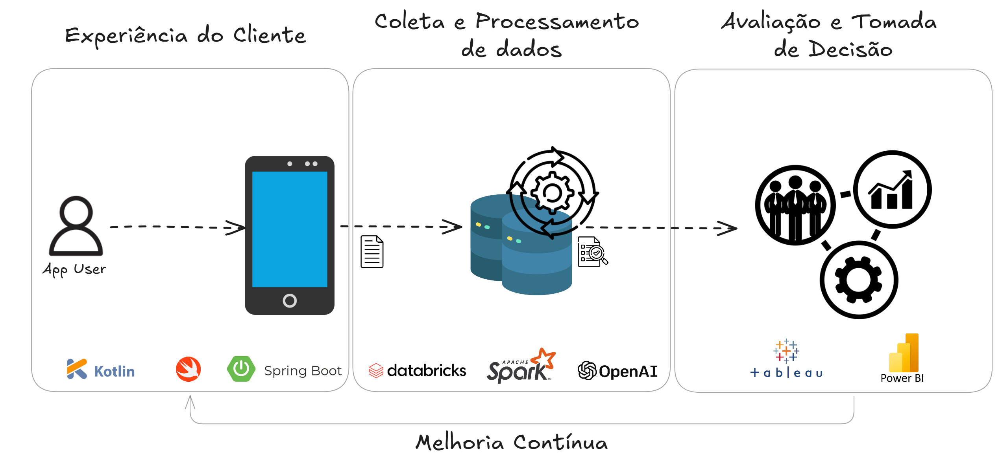
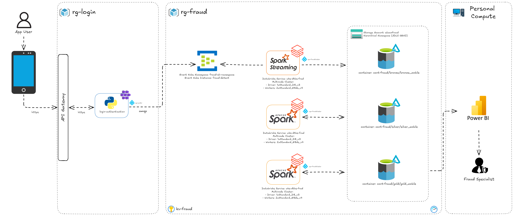

# Mobile Fraud Detect Solution - Identificando Tentativas de Fraudes em Aplicativos Mobile
## Case Data Master 2024

## I. Resumo e Objetivo do Case

  Fraudes em logins de aplicativos de transações financeiras têm se tornado cada vez mais sofisticadas, especialmente em dispositivos móveis. Uma das práticas mais comuns é o Account Takeover (ATO), que ocorre quando invasores conseguem acesso não autorizado a uma conta legítima, muitas vezes utilizando técnicas de engenharia social, phishing, ou através da forma mais básica desse tipo de ataque, que envolve ataques de força bruta orientados por bots, que enviam combinações aleatórias de caracteres a formulários de login até encontrar a combinação de credenciais da conta.

  No contexto de um aplicativo de transações financeiras, como o desenvolvido neste case, os invasores podem utilizar informações pessoais (como CPF, IMEI, MAC address ou dados de localização) para simular que estão usando um dispositivo autenticado. Através de login com credenciais roubadas, eles tentam executar transações fraudulentas, transferindo fundos ou acessando informações sensíveis.

  Os padrões de comportamento são cruciais para detectar account takeover. Entre os sinais de alerta estão:

- Logins repetidos a partir de múltiplos dispositivos desconhecidos.
- Alterações frequentes de localizações geográficas.
- Uso de dispositivos diferentes do habitual para um CPF específico.
- Discrepâncias entre a versão do sistema operacional ou da aplicação usada nos logins.
- Várias tentativas de login malsucedidas em curto intervalo de tempo.

A solução proposta neste case utiliza um fluxo robusto de ingestão de dados em tempo real, onde informações de login e do aparelho são enviados para um data lake na cloud, estas podem alimentar times de prevenção e detecção de fraudes. Com posse deses dados, é possível indentificar padrões e comportamentos suspeitos em dados históricos para retiradas de insights que podem apresentar tanto tentativas de fraudes "silenciosas", quanto auditoria de possíveis casos de ATO com sucesso.

Desta forma, este trabalho tem como objetivo implementar um case prático de coleta de logs de acesso a um aplicativo de transações financeiras, onde a arquitetura contém ingestão e transformação e visualização de dados em um data lake na cloud (Azure Data Lake Gen2).

## II. Arquitetura de Solução e Arquitetura Técnica

  Existem diversas estratégias para mitigar e resolver problemas de tentativas de fraude em sistemas Mobile e Web, desde estratégias de conscientização dos usuários a soluções Anti-Bot, onde para escolher e avaliar a estratégia mais assertiva é importante que os setores de risco e fraude consiga identificar e entender quais as principais carateríticas do perigo eminente. A coleta e avaliação de logs de aplicação como ilustrado na Figura 1 com soluções de monitoramento ou dados auxilia o profissional de fraudes e as áreas de Negócio no fluxo de escolha de estratégias de proteção e melhoria.

<p align="center">
  
  <br>
  <em>Figura 1: Arquitetura funcional de ingestão e transformação de dados para tomada de decisão</em>
</p>

  A Figura 2 apresenta a arquitetura técnica de funcionamento para ingestão e transformação de dados coletados de uma sistema de login para aplicativos móveis.

<p align="center">
  
  <br>
  <em>Figura 2: Arquitetura para ingestão e transformação de dados em um data lake na Azure</em>
</p>

  Para a ingestão foi escolhido o Eventhub com *SKU Basic* por ter o menor custo, como não é possível utilizar o *capture* para consumo dos dados do eventhub, e visando garantir que não haverá perca das mensagens devido ao intervalo de retenção do *SKU Basic* (um dia) uma solução com spark streaming para ingestão dos dados em uma camada Bronze torna-se uma opção viável.

  Na camada de processamento é possível utilizar o Databricks para realizar a ingestão e transformação dos dados garantindo segurança já que a solução envolve dados sensíveis de usuários, escalabilidade visto que geralmente aplicativos de transações financeiras atendem a milhares de usuários e existe forte sazonalidade, onde em alguns momentos é necessário um maior poder computacional, e por fim, eficiência já que conta com uma série de recursos que ajudam a otimizar os processos, como o *Adaptive Query Execution - AQE*, *Optimization*, *Z-Order* e diversos outros recursos que ajudam a reduzir custos. 

  Para ser possível sincronizar as *secrets* armazenadas no Azure Key Vault e garantir a segurança para leitura e escrita e permitindo anonimização dos dados de forma eficiente é necessário o provisionamento do Databricks *Workspace Premium* já que este permite a sincronização do *scope* com o *AKV*. 

  O *AKV* permite o armazenamentodos segredos das *Service Principals (SPNs)* para que as aplicações de ingestão e transformação de dados consigam resgatar os valores de forma segura.

  Para processamento dos dados o tipo de instância escolhida para o Driver e os Workers foi o Standard_D4s_v3, que é otimizada para cargas de trabalho gerais (já que neste case é utilizado o mesmo cluster para ingestão e transformação de dados) com um bom equilíbrio entre CPU (4 vCPUs), memória (16 GB de RAM) e capacidade de armazenamento (32 GB SSD).

  Com foco em armazenamento de grande volume de dados e com suporte nativo ao *Hadoop Distributed File System (HDFS)* facilitando a integração com ferramentas de big data como Apache Spark, Databricks e outras, o *ADLS Gen2* é uma das melhores escolhas. Contando também com camada de armazenamento hierarquico o que permite melhor desempenho ao acessar grandes quantidades de dados oraganizados em diretórios, o que é muito útil ao se adotar uma arquitetura de dados medalhão. Outra grande vantagem da utilização do *ADLS Gen2* é o suporte para criptografia de dados com chave gerenciada pelo cliente.

  Por fim, como estratégia de monitoramento foi utilizado o Azure Monitor por simplicidade, por ser uma ferramenta nativa da Azure, não sendo necessário realizar grandes configurações para coletar métricas de funcionamento da solução.
 
## III. Explicação sobre o case desenvolvido

Esqueleto: 

- Origem dos dados
- Detalhar o processo de ingestão falando da técnica utilizada e justificar a escolha, aqui falar também do que foi feito em detalhes
- falar do processo de transformação da silver e da gold
- falar qual versão do spark foi utilizada e porque
- falar como os dados estão organizados no data lake e qual foi a estratégia de particionamento
- falar sobre o destino final dos dados e sobre o dashboard
- falar sobre o monitoramento
- OBS: Falar de score de risco por aparelho, aqui dá pra falar de bases da IOS e Android e também de técnicas de ML para identificar


## IV. Melhorias e Considerações finais


#### Provisionando a infraestrutura
1 - Abrir terminal Bash da Azure e Clonar o repositório executando o comando a seguir

```bash
git clone https://github.com/Foiac/MobileFraudDetectSolution.git
```

2 - Dar permissão e executar o arquivo script.sh no diretório MobileFraudDetectSolution/Infraestrutura

```bash
# Give permission to execute .sh and run script.sh to create resource group and resources
chmod +x MobileFraudDetectSolution/Infraestrutura/script.sh
MobileFraudDetectSolution/Infraestrutura/script.sh
```

```bash
# Give permission to execute .sh # Run dbscript.sh to create databricks databricks cluster
chmod +x MobileFraudDetectSolution/Infraestrutura/databricks/cluster/dbscript.sh
MobileFraudDetectSolution/Infraestrutura/databricks/cluster/dbscript.sh
```
