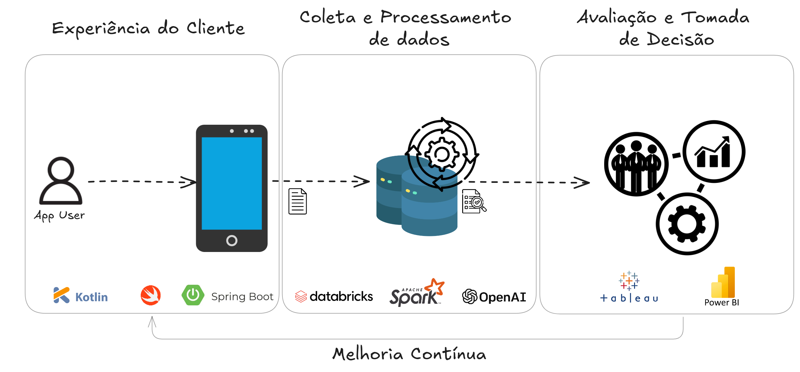
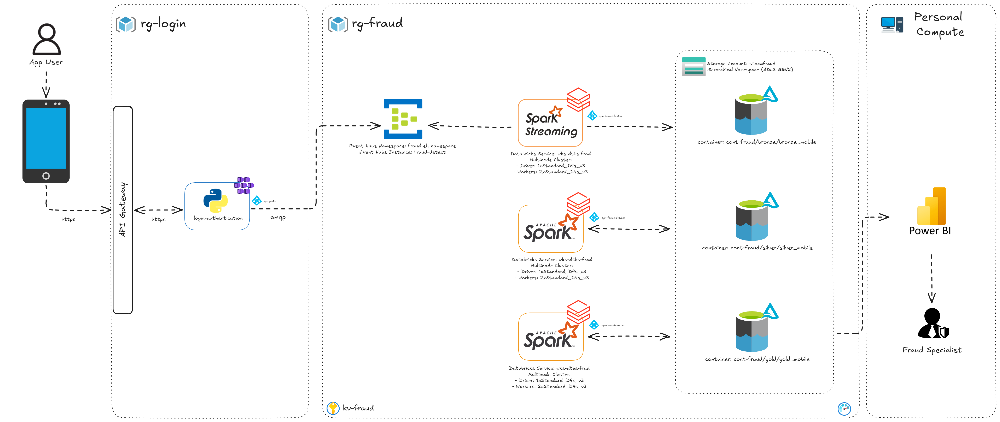
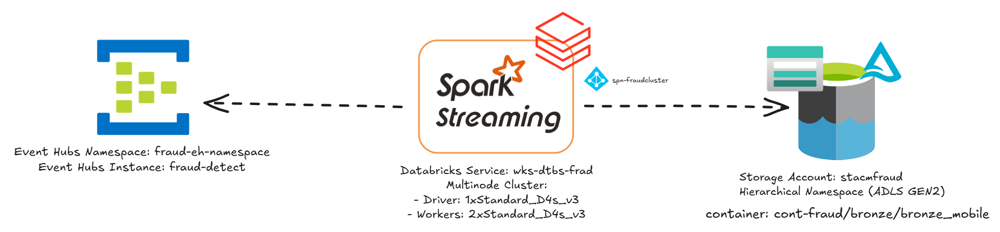
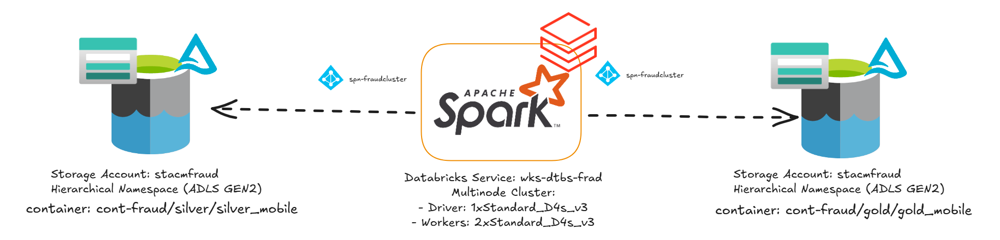
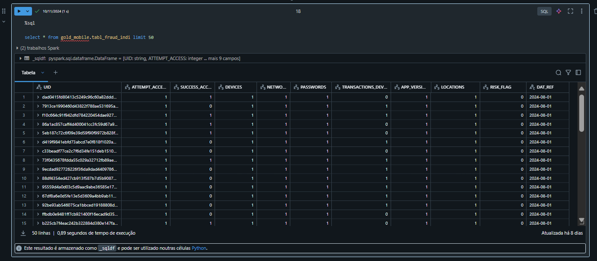
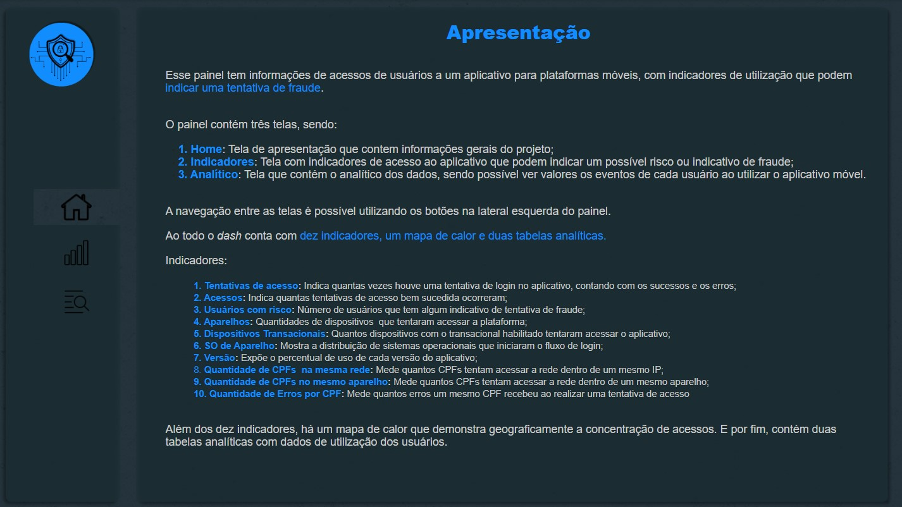
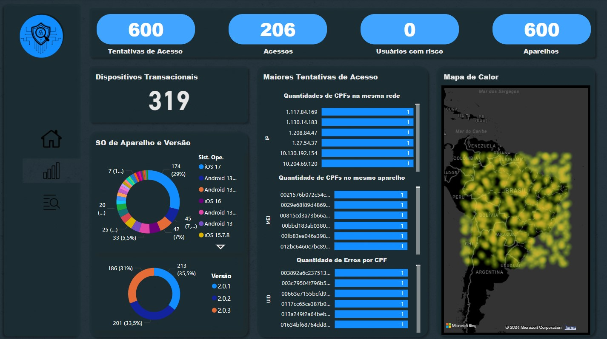
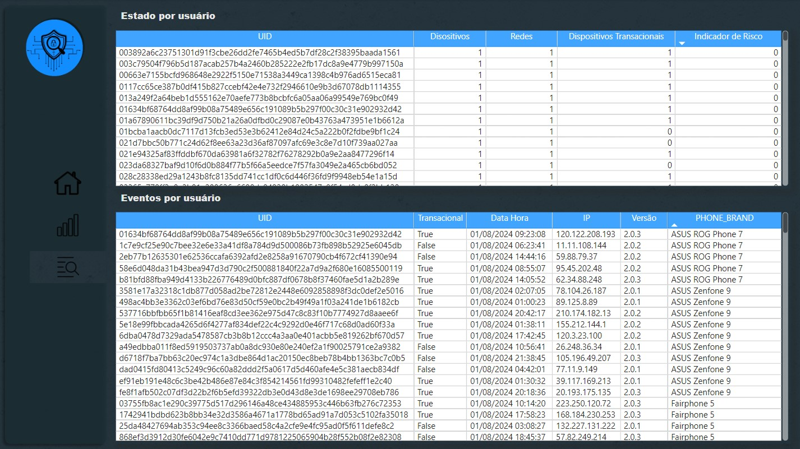
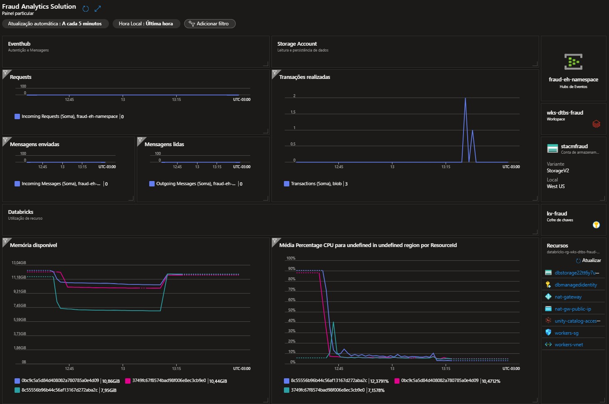

# Mobile Fraud Detect Solution - Identifying Fraud Attempts in Mobile Applications

## I. Case Summary and Objective

Fraud in financial transaction application logins has become increasingly sophisticated, especially on mobile devices. One of the most common practices is Account Takeover (ATO), which occurs when attackers gain unauthorized access to a legitimate account, often using social engineering techniques, phishing, or through the most basic form of this type of attack, which involves bot-driven brute force attacks that send random combinations of characters to login forms until they find the account's credential combination.

In the context of a financial transaction application, such as the one developed in this case, attackers can use personal information (such as CPF, IMEI, MAC address, or location data) to simulate that they are using an authenticated device. Through login with stolen credentials, they attempt to execute fraudulent transactions, transferring funds or accessing sensitive information.

Behavior patterns are crucial for detecting account takeover. Among the warning signs are:

-	Repeated logins from multiple unknown devices.
-	Frequent changes of geographic locations.
-	Use of devices different from the usual for a specific CPF.
-	Discrepancies between the operating system version or the application version used in the logins.
-	Multiple failed login attempts in a short time interval.

The solution proposed in this case uses a robust real-time data ingestion flow, where login and device information is sent to a cloud data lake, which can feed fraud prevention and detection teams. With this data in hand, it is possible to identify suspicious patterns and behaviors in historical data to extract insights that can expose fraud attempts and serve auditing processes for possible successful ATO cases.

Thus, this work aims to implement a practical case of collecting access logs from a financial transaction application, where the architecture contains data ingestion, transformation, and visualization in a cloud data lake (Azure Data Lake Gen2).

## II. Solution Architecture and Technical Architecture

There are several strategies to mitigate and solve fraud attempt problems in Mobile and Web systems, from user awareness strategies to Anti-Bot solutions. To choose and evaluate the most assertive strategy, it is important that the risk and fraud departments are able to identify and understand the main characteristics of the imminent danger. The collection and evaluation of application logs, as illustrated in Figure 1, with data solutions assists the fraud professional in this flow of choosing protection and improvement strategies.

<p align="center">
  
  <br>
  <em>Figure 1: Functional architecture for data ingestion and transformation for decision making</em>
</p>

Figure 2 presents the technical architecture for ingesting and transforming data collected from a mobile application login system, implemented as a Data Lakehouse solution on Azure, organized according to the principles of the medallion architecture.

    Data Lakehouse and Medallion Architecture
  
The Data Lakehouse concept combines the scalability and flexibility of a Data Lake with the structure and performance of a Data Warehouse, allowing the storage of large volumes of data in their raw format, while supporting optimized analytical queries directly over the data.

The [medallion architecture](https://learn.microsoft.com/pt-br/azure/databricks/lakehouse/medallion) organizes the pipeline into logical layers:

- `Bronze`: Stores raw data in its original format, such as access logs and login system events, preserving the integrity of the collected data.
- `Silver`: Contains pre-processed and cleaned data, where redundant or inconsistent information is handled, allowing for more efficient analysis.
- `Gold`: Represents the most refined layer, with transformed data ready for advanced analysis, such as detecting fraud attempts in logins.

This approach improves governance, optimizes query performance, and enables the use of advanced big data tools, such as Apache Spark and Databricks, to meet analytical requirements.

<p align="center">
  
  <br>
  <em>Figure 2: Architecture for data ingestion and transformation in a data lake on Azure</em>
</p>

The presented technical architecture consists of the following components:

[Azure Event Hub](https://learn.microsoft.com/en-us/azure/event-hubs/event-hubs-about) is a highly scalable real-time event processing and data ingestion platform, ideal for collecting and processing large volumes of data from IoT devices, application logs, or other systems. It acts as an event broker that allows the ingestion and retention of messages, making them available to consumers in near real-time or with batch processing.

For this case, the Event Hub with the Basic SKU was chosen, as it offers the lowest cost among the available plans. However, the Basic SKU has some important limitations, such as the absence of the Capture feature, which facilitates the automatic recording of events to storage for later processing, and a retention period limited to one day. Given this, to ensure that no message is lost due to the short retention interval, a solution based on Spark Streaming was adopted. This approach enables the continuous reading of Event Hub events and the writing of data directly to the Bronze layer of the data lake, allowing the ingestion pipeline to be reliable and resilient to losses.

[Azure Databricks](https://learn.microsoft.com/en-us/azure/databricks/introduction/) is a unified analytics and data science platform based on Apache Spark, designed to simplify large-scale data processing, machine learning, and data engineering. It combines distributed processing capabilities with a collaborative environment, allowing data teams to develop, test, and scale pipelines efficiently.

In this project, Databricks is the tool used in the processing layer, performing data ingestion and transformation, ensuring three fundamental pillars:

- Security: The platform offers native integration with tools such as Azure Key Vault for secure credential management and support for security policies that protect sensitive user data.
- Scalability: Designed to handle large volumes of data, it automatically adjusts computational resources to meet variable demands, such as the usage peaks common in financial or transactional applications.
- Efficiency: With features such as Adaptive Query Execution (AQE), which optimizes execution plans dynamically; Optimization, which reduces latencies; and Z-Order, which organizes data for faster access, Databricks helps optimize costs and improve query performance at scale.

An essential feature for security in Databricks is the secret scope, which allows creating secure areas in the workspace to store credentials such as keys, passwords, or tokens. This functionality eliminates the need to expose sensitive information in the code, ensuring compliance with security best practices. In addition, the integration with Azure Key Vault automates the synchronization and management of these secrets, offering an additional level of protection.

For storage, [Azure Data Lake Storage Gen2 (ADLS Gen2)](https://learn.microsoft.com/en-us/azure/storage/blobs/data-lake-storage-introduction) was adopted, due to its high capacity and native integration with the Hadoop Distributed File System (HDFS), which facilitates interaction with big data tools, such as Apache Spark and Databricks. ADLS Gen2 also offers hierarchical storage, which improves performance when accessing large volumes of data organized in directories, being especially useful in data architectures based on the medallion model. In addition, it supports data encryption with customer-managed keys, reinforcing security and meeting corporate compliance requirements.

In order to ensure a proper authorization flow between the solution components, [Service Principals](https://learn.microsoft.com/en-us/entra/identity-platform/app-objects-and-service-principals?tabs=browser) were used, which are secure identities managed in Azure Active Directory (AAD) and used for authentication and authorization in Azure resources. These identities allow applications, scripts, or automations to access Azure services with specific permissions, without the need to use user credentials.

Their importance lies in enabling centralized permission management, increasing security by avoiding the use of sensitive credentials directly in the code, in addition to enabling the implementation of granular access policies between services, such as Databricks, Event Hub, and ADLS Gen2. This ensures that each component has only the privileges necessary for its operation, reducing risks and meeting security best practices.

Finally, as a monitoring strategy, [Azure Monitor](https://learn.microsoft.com/pt-br/azure/azure-monitor/overview) was used for simplicity, as it is a native Azure tool, requiring no major configurations to collect metrics on the solution's operation.

## III. Explanation of the Developed Case

As explained earlier, the use of a streaming solution is essential to avoid the loss of messages due to expiration in the Event Hub. The Silver and Gold layers, on the other hand, are processed in batch flows, with jobs configured for daily execution, ensuring the balance between real-time processing and more refined analyses.

To replicate the infrastructure of this solution, it is necessary to have a subscription with the Azure cloud provider, in addition to creating a resource group and provisioning the following services:

- Event Hub Namespace (Basic SKU) for event ingestion;
- Azure Key Vault (Standard SKU) for secure storage of secrets;
- Storage Account with hierarchical namespace enabled, for organizing data in the Data Lake format;
- Databricks Workspace Premium, which offers advanced support for integrations and security.

To simplify the provisioning of the infrastructure, I provide the [script.sh](https://github.com/Foiac/MobileFraudDetectSolution/blob/main/Infraestrutura/script.sh), which automates the creation of the mentioned resources.

### _Cluster Databricks e Scope_

Como descrito na seção de arquitetura, é necessário a criação de um cluster, a seguir é disponibilizado o json para facilitar o provisionamento, basta substituir [my-storage-account-name] pelo nome do recurso ADLS provisionado, [my-spn-client-id] pelo *client id* da SPN criada no AAD e o [my-tenant-id] pelo *tenant id* da assinatura.

``` JSON
{
    "cluster_name": "fraud-cluster",
    "spark_version": "13.3.x-scala2.12",
    "spark_conf": {
        "spark.hadoop.fs.azure.account.oauth2.client.secret.[my-storage-account-name].dfs.core.windows.net": "{{secrets/dbwsscope/spn-secret}}",
        "spark.hadoop.fs.azure.account.oauth2.client.id.[my-storage-account-name].dfs.core.windows.net": "[my-spn-client-id]",
        "spark.hadoop.fs.azure.account.auth.type.[my-storage-account-name].dfs.core.windows.net": "OAuth",
        "spark.hadoop.fs.azure.account.oauth.provider.type.[my-storage-account-name].dfs.core.windows.net": "org.apache.hadoop.fs.azurebfs.oauth2.ClientCredsTokenProvider",
        "spark.hadoop.fs.azure.account.oauth2.client.endpoint.[my-storage-account-name].dfs.core.windows.net": "https://login.microsoftonline.com/[my-tenant-id]/oauth2/token"
    },
    "azure_attributes": {
        "first_on_demand": 1,
        "availability": "SPOT_WITH_FALLBACK_AZURE",
        "spot_bid_max_price": -1
    },
    "node_type_id": "Standard_D4s_v3",
    "driver_node_type_id": "Standard_D4s_v3",
    "autotermination_minutes": 30,
    "enable_elastic_disk": true,
    "enable_local_disk_encryption": false,
    "runtime_engine": "STANDARD",
    "effective_spark_version": "11.3.x-scala2.12",
    "autoscale": {
        "min_workers": 2,
        "max_workers": 2
    },
    "apply_policy_default_values": false
}
```

Como nas configurações do spark é referenciado uma variável para consumo da secret do Scope do datrabricks, é necessário realizar cerimônia de senha para inserir a secret da *Service Principal* criada no AKV e sincronizar o mesmo com o scope criado no Databricks. O processo de criação e sincronização pode ser consultado na [documentação da Azure](https://learn.microsoft.com/en-us/azure/databricks/security/secrets/).

Para o cluster foi utilizado a versão Databricks Runtime [13.3](https://learn.microsoft.com/pt-br/azure/databricks/release-notes/runtime/13.3lts) que conta com a versão 3.4.1 do Apache Spark sendo uma versão robusta e estável.

### _Ingestão `Bronze`_

Todo o desenvolvimento deste trabalho se concentra na solução de ingestão e transformação de dados, abordando e utilizando técnicas de Engenharia de Dados, assim, o desenvolvimento da ingestão de dados no Eventhub foi implementado através de um notebook Python que gera e realiza o envio dos dados para o broker de mensageria através do protocolo AMQP, utilizando uma Service Principal com *role* apenas de envio de dados, onde o notebook desenvolvido para esta solução é encontrado em [loginAuthenticationMockData.ipyn](https://github.com/Foiac/MobileFraudDetectSolution/blob/main/dev-notebooks/0%20-%20mockData/loginAuthenticationMockData.ipynb). O processo de envio dos dados para o tópico do eventhub é possível através da utilização dos pacotes [`azure-identity`](https://learn.microsoft.com/en-us/python/api/overview/azure/identity-readme?view=azure-python) para autorizar o componente através da *SPN* spn-prdcr e [`azure-eventhub`](https://learn.microsoft.com/en-us/azure/event-hubs/event-hubs-python-get-started-send?tabs=passwordless%2Croles-azure-portal) para realização de comunicação com o recurso, permitindo envio das informações utilizando *batches* de eventos produzidos pelo componente Python.

Afim de ler as mensagens do tópico e gravar em uma `Delta Table` no *ADLS*, como apresentado na Figura 3, a solução streaming realiza um fluxo de leitura do Eventhub utilizando o pacote [`azure-event-hubs-spark`](https://github.com/Azure/azure-event-hubs-spark) que simplifica a conexão do Spark com o eventhub, sendo necessário a instalação do pacote no cluster provisionado no Databricks. Uma das desvantagens da utilização desse conector é que não há suporte para processo de autorização das mensagens com AAD através da SPN de forma simples, a documentação apresenta uma forma de realizar a autenticação via AAD com uma adaptação através da criação de uma classe de callback desenvolvida em Scala, para mais detalhes seguir o [link](https://github.com/Azure/azure-event-hubs-spark/blob/master/docs/use-aad-authentication-to-connect-eventhubs.md), mas para simplificar o case e reduzir o desenvolvimento a somente uma linguagem de programação, optou-se pela autorização através de *Connection String* do eventhub armazenado no AKV, sincronizando o segredo com o *Scope* do Databricks.

<p align="center">
  
  <br>
  <em>Figura 3: Leitura das mensagens do Eventhub e geração de Delta Table no ADLS Gen2</em>
</p>

Para garantir segurança sobre os dados sensíveis foi utilizado uma estratégia de anonimização da informação no momento da ingestão na camada `Bronze`, criou-se um hash com SHA-256 nas informações de IMEI, MAC, CPF e Senha de usuário concatenando estas com uma palavra-chave armazenado no *Scope* do Databricks e resgatada em tempo de execução.

Por fim, para escrita dos dados, no *Storage Account* configurou-se no Spark Streaming uma janela de processamento de 2 minutos para criação do data frame e por consequência o arquivo parquet em uma Delta Table. É possível ter mais detalhes sobre o job de ingestão olhando o código desenvolido no notebook [dataStreamingLoad.ipynb](https://github.com/Foiac/MobileFraudDetectSolution/blob/main/dev-notebooks/1%20-%20eventhubToBronzeStreaming/dataStreamingLoad.ipynb).

### _Tabela `Silver`_

O processo de criação da tabela `Silver`, apresentado na Figura 4, envolve a normalização dos dados ingeridos, com o objetivo de corrigir possíveis inconsistências geradas durante a ingestão e, assim, melhorar a qualidade das análises. Durante a transformação dos dados da camada Bronze, também ocorre a conversão de informações técnicas em dados mais funcionais.

Como o objetivo final é fornecer insumos para profissionais de combate a fraudes, que estão mais focados em padrões de comportamento que indicam risco, colunas técnicas, como erro, API e endpoint, são traduzidas em informações mais simples e acessíveis, facilitando a identificação de perfis de risco por equipes com menor especialização técnica.

<p align="center">
  
  <br>
  <em>Figura 4: Job de transformação de dados para geração de uma camada Silver</em>
</p>

O job de transformação dos dados para a camada `Silver` foi desenvolvido com foco na execução diária e no incremento da tabela já existente. Para mais detalhes sobre a implementação do job, é possível consultar o notebook [dataJobClean.ipynb](https://github.com/Foiac/MobileFraudDetectSolution/blob/main/dev-notebooks/2%20-%20silverBatch/dataJobClean.ipynb). que descreve o fluxo completo e as operações realizadas.

### _Tabela `Gold`_

Para a geração de dados altamente agregados e com informações que facilitam a detecção de fraudes, foi adotado um método de *Feature Engineering* na criação da tabela `Gold`, apresentada na Figura 5. Nessa camada, a solução envolve a criação de uma tabela com colunas específicas para agregação por usuário, incluindo métricas como: quantidade de tentativas de acesso, acessos bem-sucedidos, número de dispositivos utilizados, diversidade de redes acessadas, contagem de senhas empregadas, número de dispositivos habilitados para transações, quantidade distinta de versões de aplicativo usadas, total de localizações distintas e uma coluna de *flag* indicando o risco de fraude. Essas variáveis agregadas permitem análises mais precisas e a identificação de padrões suspeitos que podem indicar atividades fraudulentas.

<p align="center">
  
  <br>
  <em>Figura 5: Job de transformação de dados para geração de uma camada Gold com valor para o negócio</em>
</p>

A geração do indicador de risco foi baseada em regras simples, porém eficazes, que consideram fatores como a quantidade de acessos realizados, dispositivos habilitados para transações, variedade de senhas tentadas e as localizações onde os acessos ocorreram no mesmo dia. Essas regras foram escolhidas estrategicamente por sua capacidade de identificar comportamentos incomuns que podem ser indicativos de risco. A amostra da tabela gerada, ilustrada na Figura 6, demonstra como essas métricas são organizadas para análise.

Essa abordagem é uma boa estratégia porque combina simplicidade com efetividade. Embora as regras sejam simples, elas são altamente interpretáveis e fáceis de implementar, permitindo uma rápida identificação de padrões anômalos sem a necessidade de modelos complexos. Além disso, a análise de múltiplos fatores (como dispositivos, senhas e localizações) em um único indicador fornece uma visão mais robusta e granular do comportamento do usuário, ajudando a detectar tentativas de fraude com maior precisão. A utilização de métricas quantitativas também facilita a definição de limiares de risco, tornando o processo de detecção mais ágil e transparente.

<p align="center">
  
  <br>
  <em>Figura 6: Amostra da tabela Gold agregada por usuário com números quantitativos dos acessos do usuário no dia</em>
</p>

Mais detalhes sobre o processo de criação da tabela Gold, é possível verificar no notebook [dataJobUserAgg.ipynb](https://github.com/Foiac/MobileFraudDetectSolution/blob/main/dev-notebooks/3%20-%20goldBatch/dataJobUserAgg.ipynb).

### _Particionamento e Otimização_

O particionamento de tabelas no Databricks é uma técnica essencial para melhorar o desempenho de leitura e gestão de grandes volumes de dados. Ao particionar uma tabela, os dados são divididos em subpastas baseadas em uma ou mais colunas, como datas ou localizações, o que permite que apenas as partições relevantes sejam lidas durante as consultas, otimizando a performance. No entanto, de acordo com a [documentação](https://docs.databricks.com/pt/tables/partitions.html) da Databricks é recomendado evitar o particionamento de tabelas menores que 1TB, pois o custo de gerenciamento de muitas partições pequenas pode superar os benefícios de desempenho. Por essa razão, nesta solução, o particionamento não foi utilizado, pois o tamanho das partições depende diretamente do TPS (Transações Por Segundo) da solução de login do aplicativo, que pode não justificar o particionamento com o tamanho atual dos dados.

Sem o particionamento da tabela, comando [`OPTIMIZE`](https://learn.microsoft.com/pt-br/azure/databricks/sql/language-manual/delta-optimize) no Databricks é utilizado para melhorar o desempenho de leitura de uma tabela Delta, realizando a compactação de arquivos pequenos em partições maiores. Isso é especialmente útil quando você tem uma tabela com muitas partições ou arquivos pequenos, o que pode gerar overhead durante a leitura dos dados. O `OPTIMIZE` reorganiza fisicamente os dados, reduzindo o número de arquivos e aumentando a eficiência das consultas subsequentes. Para este case, foi desenvolvido dois jobs para otimização dos arquivos parquets gerados em cada tabela, podendo ser verificado nos notebooks [optimizeSilverDeltaTable.ipynb](https://github.com/Foiac/MobileFraudDetectSolution/blob/main/dev-notebooks/4%20-%20optimize/optimizeSilverDeltaTable.ipynb) e [optimizeGoldDeltaTable.ipynb](https://github.com/Foiac/MobileFraudDetectSolution/blob/main/dev-notebooks/4%20-%20optimize/optimizeGoldDeltaTable.ipynb).

### _Exemplo de Data Visualization_

Como sugestão de painel para identificação rápida de eventos e usuários com riscos de fraudes, foi construído um relatório com *Power BI*, ilustrado na Figura 7, Figura 8 e Figura 9. O arquivo *`PBIX`*  está disponível no [link](https://github.com/Foiac/MobileFraudDetectSolution/tree/main/Editaveis/PBI). Para conseguir realizar a conexão com o Azure databricks foi necessário configurar o conector no Power BI inserindo o *Access Token* gerado via Workspace do Databricks e as informações JDBC do cluster, tutorial disponível [aqui](https://docs.databricks.com/pt/partners/bi/power-bi.html#connect-power-bi-desktop-to-databricks) 

<p align="center">
  
  <br>
  <em>Figura 7: Home do painel com informações de apresentação e descrição das métricas</em>
</p>

<p align="center">
  
  <br>
  <em>Figura 8: Tela de indicadores</em>
</p>

<p align="center">
  
  <br>
  <em>Figura 9: Analítico para avaliação de eventos por usuário</em>
</p>

### _Monitoramento_

Como estratégia de monitoramento da solução, adotou-se a utilização do Azure Monitor com a construção de um painel para monitoramento do processo de ingestão de dados no tópico e processo de leitura e persistência dos dados na camada `Bronze`, ilustrado na Figura 10 e 
arquivo para importação e replicação disponível no [json](https://github.com/Foiac/MobileFraudDetectSolution/blob/main/Editaveis/Monitoramento/Fraud%20Analytics%20Solution%20Azure%20Monitor.json).

<p align="center">
  
  <br>
  <em>Figura 10: Dashboard de monitoração da solução</em>
</p>

O dash fornece algumas informações básicas para detectar possíveis problemas ao realizar ingestão de dados, ou gargalos na pipeline de dados, para realizar *troubleshooting* basta clicar no recurso no lado direito do painel e investigar as métricas e logs do mesmo mais a fundo, para as métricas do spark é importante acessar também as métricas e logs do cluster para entender onde surge a causa raiz de um possível problema.

## IV. Melhorias e Considerações finais

A solução proposta representa uma base robusta para detecção de fraudes em aplicativos móveis, demonstrando como arquiteturas Data Lakehouse podem ser aplicadas a problemas complexos. No entanto, existem diversas oportunidades para expandir e otimizar a arquitetura, elevando seu desempenho e ampliando a aplicabilidade em cenários reais de produção.

Uma das melhorias mais relevantes seria ampliar a solução para atender a cenários de transações financeiras mais complexos, como a prevenção à lavagem de dinheiro (AML). Isso envolveria a criação de algoritmos que detectem padrões de transferências atípicas, também sendo possível o cruzamento das informações com bases de dados externas, como listas de sanções ou suspeitos. Essa abordagem permitiria não apenas identificar fraudes, mas também garantir a conformidade com regulamentações financeiras.

Outra evolução seria a integração de técnicas de Machine Learning para ampliar o poder analítico da solução. Modelos como Isolation Forest, DBSCAN ou K-Means podem identificar padrões anômalos em dados de login e transações. Pipelines de CI/CD seriam indispensáveis para automatizar o provisionamento e o deployment, aumentando a agilidade na entrega de melhorias e novas funcionalidades.

Por fim, para rodar a solução em um ambiente produtivo, é fundamental orquestrar os processos de ingestão, transformação e otimização de dados de forma automatizada, utilizando ferramentas como Databricks Workflows ou Azure Data Factory para garantir consistência e eficiência. Políticas de gerenciamento de clusters no Databricks e jobs de expurgo dos dados também desempenham um papel crucial, ajudando a controlar custos, reforçar a segurança e evitar configurações inadequadas que possam comprometer a operação.

