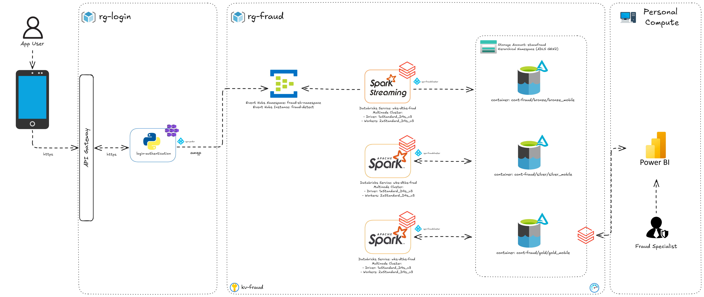

# Mobile Fraud Detect Solution - Identificando Tentativas de Fraudes em Aplicativos Mobile

## I. Resumo e Objetivo do Case

Fraudes em logins de aplicativos de transações financeiras têm se tornado cada vez mais sofisticadas, especialmente em dispositivos móveis. Uma das práticas mais comuns é o Account Takeover (ATO), que ocorre quando invasores conseguem acesso não autorizado a uma conta legítima, muitas vezes utilizando técnicas de engenharia social, phishing, ou através da forma mais básica desse tipo de ataque, que envolve ataques de força bruta orientados por bots, que enviam combinações aleatórias de caracteres a formulários de login até encontrar a combinação de credenciais da conta.

No contexto de um aplicativo de transações financeiras, como o desenvolvido neste case, os invasores podem utilizar informações pessoais (como CPF, IMEI, MAC address ou dados de localização) para simular que estão usando um dispositivo autenticado. Através de login com credenciais roubadas, eles tentam executar transações fraudulentas, transferindo fundos ou acessando informações sensíveis.

Os padrões de comportamento são cruciais para detectar account takeover. Entre os sinais de alerta estão:

- Logins repetidos a partir de múltiplos dispositivos desconhecidos.
- Alterações frequentes de localizações geográficas.
- Uso de dispositivos diferentes do habitual para um CPF específico.
- Discrepâncias entre a versão do sistema operacional ou da aplicação usada nos logins.
- Várias tentativas de login malsucedidas em curto intervalo de tempo.

A solução proposta neste case utiliza um fluxo robusto de ingestão de dados em tempo real, onde informações de login e do aparelho são enviados para um data lake na cloud, estas podem alimentar times de prevenção e detecção de fraudes. Com posse deses dados, é possível indentificar padrões e comportamentos suspeitos em dados históricos para retiradas de insights que podem apresentar tanto tentativas de fraudes "silenciosas", quanto auditoria de possíveis casos de ATO com sucesso.

Desta forma, este trabalho tem como objetivo implementar um case prático de coleta de logs de acesso a um aplicativo de transações financeiras, onde a arquitetura contém ingestão e transformação e visualização de dados em um data lake na cloud (Azure Data Lake Gen2).

## II. Arquitetura de Solução e Arquitetura Técnica

Existem diversas estratégias para mitigar e resolver problemas de tentativas de fraude em sistemas Mobile e Web, desde estratégias de conscientização dos usuários a soluções Anti-Bot, onde para escolher e avaliar a estratégia mais assertiva é importante que os setores de riscos e fraudes consigam identificar e entender quais as principais carateríticas do perigo eminente. A coleta e avaliação de logs de aplicação, como ilustrado na Figura 1, com soluções de dados-auxilia o profissional de fraudes neste fluxo de escolha de estratégias de proteção e melhoria.

<p align="center">
  
  <br>
  <em>Figura 1: Arquitetura funcional de ingestão e transformação de dados para tomada de decisão</em>
</p>

A Figura 2 apresenta a arquitetura técnica de ingestão e transformação de dados coletados de um sistema de login de aplicativos móveis, implementada como uma solução de Data Lakehouse na Azure, organizada de acordo com os princípios da arquitetura medalhão.

    Data Lakehouse e Arquitetura Medalhão
  
O conceito de Data Lakehouse combina a escalabilidade e flexibilidade de um Data Lake com a estrutura e o desempenho de um Data Warehouse, permitindo o armazenamento de grandes volumes de dados em seu formato bruto, enquanto oferece suporte a consultas analíticas otimizadas diretamente sobre os dados.

A arquitetura medalhão organiza o pipeline em camadas lógicas:

- `Bronze`: Armazena os dados brutos no formato original, como logs de acesso e eventos do sistema de login, preservando a integridade dos dados coletados.
- `Silver`: Contém dados pré-processados e limpos, onde informações redundantes ou inconsistentes são tratadas, permitindo uma análise mais eficiente.
- `Gold`: Representa a camada mais refinada, com dados transformados e prontos para análise avançada, como a detecção de tentativas de fraude em logins.

Essa abordagem melhora a governança, otimiza o desempenho das consultas e possibilita o uso de ferramentas avançadas de big data, como Apache Spark e Databricks, para atender a requisitos analíticos.

<p align="center">
  
  <br>
  <em>Figura 2: Arquitetura para ingestão e transformação de dados em um data lake na Azure</em>
</p>

A arquitetura téncica apresentada consiste nos seguintes componentes:

O [Azure Event Hub](https://learn.microsoft.com/en-us/azure/event-hubs/event-hubs-about) é uma plataforma de processamento de eventos em tempo real e ingestão de dados altamente escalável, ideal para coletar e processar grandes volumes de dados provenientes de dispositivos IoT, logs de aplicativos ou outros sistemas. Ele atua como um event broker que permite a ingestão e retenção de mensagens, disponibilizando-as para consumidores em tempo quase real ou com processamento em lotes.

Para este caso, optou-se pelo uso do Event Hub com o SKU Basic, pois oferece o menor custo entre os planos disponíveis. No entanto, o SKU Basic possui algumas limitações importantes, como a ausência do recurso Capture, que facilita a gravação automática dos eventos em um armazenamento para processamento posterior, e um período de retenção limitado a um dia. Diante disso, para garantir que nenhuma mensagem seja perdida devido ao intervalo curto de retenção, foi adotada uma solução baseada no Spark Streaming. Essa abordagem possibilita a leitura contínua dos eventos do Event Hub e a gravação dos dados diretamente na camada Bronze do data lake, permitindo que o pipeline de ingestão seja confiável e resiliente a perdas.

O [Azure Databricks](https://learn.microsoft.com/en-us/azure/databricks/introduction/) é uma plataforma unificada de análise e ciência de dados baseada em Apache Spark, projetada para simplificar o processamento de dados em larga escala, aprendizado de máquina e engenharia de dados. Ele combina recursos de processamento distribuído com um ambiente colaborativo, permitindo que equipes de dados desenvolvam, testem e escalem pipelines de maneira eficiente.

Neste projeto, o Databricks é a ferramente utilzada na camada de processamento, realizando ingestão e transformação de dados, garantindo três pilares fundamentais:

- Segurança: A plataforma oferece integração nativa com ferramentas como o Azure Key Vault para gerenciamento seguro de credenciais e suporte a políticas de segurança que protegem dados sensíveis de usuários.
- Escalabilidade: Projetado para lidar com grandes volumes de dados, ele ajusta automaticamente os recursos computacionais para atender a demandas variáveis, como os picos de uso comuns em aplicativos financeiros ou transacionais.
- Eficiência: Com recursos como Adaptive Query Execution (AQE), que otimiza os planos de execução dinamicamente; Optimization, que reduz latências; e Z-Order, que organiza dados para acessos mais rápidos, o Databricks ajuda a otimizar custos e melhorar o desempenho de consultas em grande escala.

Um recurso essencial para segurança no Databricks é o scope de segredos, que permite criar áreas seguras no workspace para armazenar credenciais como chaves, senhas ou tokens. Essa funcionalidade elimina a necessidade de expor informações sensíveis no código, garantindo conformidade com as melhores práticas de segurança. Além disso, a integração com o Azure Key Vault automatiza a sincronização e o gerenciamento desses segredos, oferecendo um nível adicional de proteção.

Para armazenamento, foi adotado o [Azure Data Lake Storage Gen2 (ADLS Gen2)](https://learn.microsoft.com/en-us/azure/storage/blobs/data-lake-storage-introduction), devido à sua alta capacidade e integração nativa com o Hadoop Distributed File System (HDFS), o que facilita a interação com ferramentas de big data, como Apache Spark e Databricks. O ADLS Gen2 também oferece um armazenamento hierárquico, que melhora o desempenho ao acessar grandes volumes de dados organizados em diretórios, sendo especialmente útil em arquiteturas de dados baseadas no modelo medalhão. Além disso, ele suporta criptografia de dados com chaves gerenciadas pelo cliente, reforçando a segurança e atendendo a requisitos de compliance corporativo.

Afim de garantir um devido fluxo de autorização entre os componentes da solução, utilizou-se [Service Principals](https://learn.microsoft.com/en-us/entra/identity-platform/app-objects-and-service-principals?tabs=browser), que são identidades seguras gerenciadas no Azure Active Directory (AAD) e utilizadas para autenticação e autorização em recursos da Azure. Essas identidades permitem que aplicativos, scripts ou automações acessem serviços do Azure com permissões específicas, sem a necessidade de usar credenciais de usuário.

Sua importância está em permitir um gerenciamento centralizado de permissões, aumentando a segurança ao evitar o uso de credenciais sensíveis diretamente no código, além de possibilitar a implementação de políticas de acesso granular entre os serviços, como o Databricks, Event Hub e o ADLS Gen2. Isso garante que cada componente tenha apenas os privilégios necessários para sua operação, reduzindo riscos e atendendo a boas práticas de segurança.

Por fim, como estratégia de monitoramento foi utilizado o [Azure Monitor](https://learn.microsoft.com/pt-br/azure/azure-monitor/overview) por simplicidade, por ser uma ferramenta nativa da Azure, não sendo necessário realizar grandes configurações para coletar métricas de funcionamento da solução.

## III. Explicação sobre o case desenvolvido

Como explicado anteriormente, a utilização de uma solução streaming é essencial para evitar a perda de mensagens por expiração no Event Hub. Já as camadas Silver e Gold são processadas em fluxos batch, com jobs configurados para execução diária, garantindo o balanceamento entre processamento em tempo real e análises mais refinadas.

Para replicar a infraestrutura desta solução, é necessário possuir uma assinatura no provedor de cloud Azure, além de criar um grupo de recursos e provisionar os seguintes serviços:

- Event Hub Namespace (SKU Básico) para ingestão de eventos;
- Azure Key Vault (SKU Padrão) para armazenamento seguro de segredos;
- Storage Account com namespace hierárquico habilitado, para organização dos dados no formato Data Lake;
- Databricks Workspace Premium, que oferece suporte avançado a integrações e segurança.

Para simplificar o provisionamento da infraestrutura, disponibilizo o script.sh, que automatiza a criação dos recursos mencionados.

### _Cluster Databricks e Scope_

Como descrito na seção de arquitetura, é necessário a criação de um cluster, a seguir é disponibilizado o json para facilitar o provisionamento, basta substituir [my-storage-account-name] pelo nome do recurso ADLS provisionado, [my-spn-client-id] pelo *client id* da SPN criada no AAD e o [my-tenant-id] pelo *tenant id* da assinatura.

``` JSON
{
    "cluster_name": "fraud-cluster",
    "spark_version": "13.3.x-scala2.12",
    "spark_conf": {
        "spark.hadoop.fs.azure.account.oauth2.client.secret.[my-storage-account-name].dfs.core.windows.net": "{{secrets/dbwsscope/spn-secret}}",
        "spark.hadoop.fs.azure.account.oauth2.client.id.[my-storage-account-name].dfs.core.windows.net": "[my-spn-client-id]",
        "spark.hadoop.fs.azure.account.auth.type.[my-storage-account-name].dfs.core.windows.net": "OAuth",
        "spark.hadoop.fs.azure.account.oauth.provider.type.[my-storage-account-name].dfs.core.windows.net": "org.apache.hadoop.fs.azurebfs.oauth2.ClientCredsTokenProvider",
        "spark.hadoop.fs.azure.account.oauth2.client.endpoint.[my-storage-account-name].dfs.core.windows.net": "https://login.microsoftonline.com/[my-tenant-id]/oauth2/token"
    },
    "azure_attributes": {
        "first_on_demand": 1,
        "availability": "SPOT_WITH_FALLBACK_AZURE",
        "spot_bid_max_price": -1
    },
    "node_type_id": "Standard_D4s_v3",
    "driver_node_type_id": "Standard_D4s_v3",
    "autotermination_minutes": 30,
    "enable_elastic_disk": true,
    "enable_local_disk_encryption": false,
    "runtime_engine": "STANDARD",
    "effective_spark_version": "11.3.x-scala2.12",
    "autoscale": {
        "min_workers": 2,
        "max_workers": 2
    },
    "apply_policy_default_values": false
}
```

Como nas configurações do spark é referenciado uma variável para consumo da secret do Scope do datrabricks, é necessário realizar cerimônia de senha para inserir a secret da *Service Principal* criada no AKV e sincronizar o mesmo com o scope criado no Databricks. O processo de criação e sincronização pode ser consultado na [documentação da Azure](https://learn.microsoft.com/pt-br/azure/databricks/security/secrets/secret-scopes).

Para o cluster foi utilizado a versão Databricks Runtime [13.3](https://learn.microsoft.com/pt-br/azure/databricks/release-notes/runtime/13.3lts) que conta com a versão 3.4.1 do Apache Spark sendo uma versão robusta e estável.

### _Ingestão `Bronze`_

Todo o desenvolvimento deste trabalho se concentra na solução de ingestão e transformação de dados, abordando e utilizando técnicas de Engenharia de Dados, assim, o desenvolvimento da ingestão de dados no Eventhub foi implementado através de um notebook Python que gera e realiza o envio dos dados para o broker de mensageria através do protocolo AMQP, utilizando uma Service Principal com *role* apenas de envio de dados, onde o notebook desenvolvido para esta solução é encontrado em [loginAuthenticationMockData.ipyn](https://github.com/Foiac/MobileFraudDetectSolution/blob/main/dev-notebooks/0%20-%20mockData/loginAuthenticationMockData.ipynb). O processo de envio dos dados para o tópico do eventhub é possível através da utilização dos pacotes [`azure-identity`](https://learn.microsoft.com/en-us/python/api/overview/azure/identity-readme?view=azure-python) para autorizar o componente através da *SPN* spn-prdcr e [`azure-eventhub`](https://learn.microsoft.com/en-us/azure/event-hubs/event-hubs-python-get-started-send?tabs=passwordless%2Croles-azure-portal) para realização de comunicação com o recurso, permitindo envio das informações utilizando *batches* de eventos produzidos pelo componente Python.

Afim de ler as mensagens do tópico e gravar em uma `Delta Table` no *ADLS*, como apresentado na Figura 3, a solução streaming realiza um fluxo de leitura do Eventhub utilizando o pacote [`azure-event-hubs-spark`](https://github.com/Azure/azure-event-hubs-spark) que simplifica a conexão do Spark com o eventhub, sendo necessário a instalação do pacote no cluster provisionado no Databricks. Uma das desvantagens da utilização desse conector é que não há suporte para processo de autorização das mensagens com AAD através da SPN de forma simples, a documentação apresenta uma forma de realizar a autenticação via AAD com uma adaptação através da criação de uma classe de callback desenvolvida em Scala, para mais detalhes seguir o [link](https://github.com/Azure/azure-event-hubs-spark/blob/master/docs/use-aad-authentication-to-connect-eventhubs.md), mas para simplificar o case e reduzir o desenvolvimento a somente uma linguagem de programação, optou-se pela autorização através de *Connection String* do eventhub armazenado no AKV, sincronizando o segredo com o *Scope* do Databricks.

<p align="center">
  
  <br>
  <em>Figura 3: Leitura das mensagens do Eventhub e geração de Delta Table no ADLS Gen2</em>
</p>

Para garantir segurança sobre os dados sensíveis foi utilizado uma estratégia de anonimização da informação no momento da ingestão na camada `Bronze`, criou-se um hash com SHA-256 nas informações de IMEI, MAC, CPF e Senha de usuário concatenando estas com uma palavra chave armazenado no *Scope* do Databricks e resgatada em tempo de execução.

Por fim, para escrita dos dados, no *Storage Account* configurou-se no Spark Streaming uma janela de processamento de 2 minutos para criação do data frame e por consequência o arquivo parquet em uma Delta Table. É possível ter mais detalhes sobre o job de ingestão olhando o código desenvolido no notebook [dataStreamingLoad.ipynb](https://github.com/Foiac/MobileFraudDetectSolution/blob/main/dev-notebooks/1%20-%20eventhubToBronzeStreaming/dataStreamingLoad.ipynb).

### _Tabela `Silver`_

O processo de criação da tabela `Silver`, apresentado na Figura 4, envolve a normalização dos dados ingeridos, com o objetivo de corrigir possíveis inconsistências geradas durante a ingestão e, assim, melhorar a qualidade das análises. Durante a transformação dos dados da camada Bronze, também ocorre a conversão de informações técnicas em dados mais funcionais.

Como o objetivo final é fornecer insumos para profissionais de combate a fraudes, que estão mais focados em padrões de comportamento que indicam risco, colunas técnicas, como erro, API e endpoint, são traduzidas em informações mais simples e acessíveis, facilitando a identificação de perfis de risco por equipes com menor especialização técnica.

<p align="center">
  
  <br>
  <em>Figura 4: Job de transformação de dados para geração de uma camada Silver</em>
</p>

O job de transformação dos dados para a camada `Silver` foi desenvolvido com foco na execução diária e no incremento incremental da tabela já existente. A transformação é realizada criando partições na tabela Delta com base na data de criação do evento, garantindo eficiência e organização dos dados ao longo do tempo. Para mais detalhes sobre a implementação do job, é possível consultar o notebook [dataJobClean.ipynb](https://github.com/Foiac/MobileFraudDetectSolution/blob/main/dev-notebooks/2%20-%20silverBatch/dataJobClean.ipynb). que descreve o fluxo completo e as operações realizadas.

### _Tabela `Gold`_

Para a geração de dados altamente agregados e com informações que facilitam a detecção de fraudes, foi adotado um método de *Feature Engineering* na criação da tabela `Gold`, apresentada na Figura 5. Nessa camada, a solução envolve a criação de uma tabela com colunas específicas para agregação por usuário, incluindo métricas como: quantidade de tentativas de acesso, acessos bem-sucedidos, número de dispositivos utilizados, diversidade de redes acessadas, contagem de senhas empregadas, número de dispositivos habilitados para transações, quantidade distinta de versões de aplicativo usadas, total de localizações distintas e uma coluna de *flag*  indicando o risco de fraude. Essas variáveis agregadas permitem análises mais precisas e a identificação de padrões suspeitos que podem indicar atividades fraudulentas.

<p align="center">
  
  <br>
  <em>Figura 5: Job de transformação de dados para geração de uma camada Gold com valor para o negócio</em>
</p>

A geração do indicador de risco foi baseada em regras simples, porém eficazes, que consideram fatores como a quantidade de acessos realizados, dispositivos habilitados para transações, variedade de senhas tentadas e as localizações onde os acessos ocorreram no mesmo dia. Essas regras foram escolhidas estrategicamente por sua capacidade de identificar comportamentos incomuns que podem ser indicativos de risco. A amostra da tabela gerada, ilustrada na Figura 6, demonstra como essas métricas são organizadas para análise.

Essa abordagem é uma boa estratégia porque combina simplicidade com efetividade. Embora as regras sejam simples, elas são altamente interpretáveis e fáceis de implementar, permitindo uma rápida identificação de padrões anômalos sem a necessidade de modelos complexos. Além disso, a análise de múltiplos fatores (como dispositivos, senhas e localizações) em um único indicador fornece uma visão mais robusta e granular do comportamento do usuário, ajudando a detectar tentativas de fraude com maior precisão. A utilização de métricas quantitativas também facilita a definição de limiares de risco, tornando o processo de detecção mais ágil e transparente.

<p align="center">
  
  <br>
  <em>Figura 6: Amostra da tabela Gold agregada por usuário com números quantitativos dos acessos do usuário no dia</em>
</p>

Mais detalhes sobre o processo de criação da tabela Gold, é possível verificar no notebook [dataJobUserAgg.ipynb](https://github.com/Foiac/MobileFraudDetectSolution/blob/main/dev-notebooks/4%20-%20goldBatch/dataJobUserAgg.ipynb).

### _Exemplo de Data Visualization_

Como sugestão de painel para identificação rápida de eventos e usuários com riscos de fraudes, foi construido um relatório com *Power BI*, ilustrado na Figura 7, Figura 8 e Figura 9. O arquivo *`PBIX`*  está disponível no [link](https://github.com/Foiac/MobileFraudDetectSolution/tree/main/Editaveis/PBI). Para conseguir realizar a conexão com o Azure databricks foi necessário configurar o conector no Power BI inserindo o *Access Token* gerado via Workspace do Databricks e as informações JDBC do cluster, tutorial disponível [aqui](https://docs.databricks.com/pt/partners/bi/power-bi.html#connect-power-bi-desktop-to-databricks) 

<p align="center">
  
  <br>
  <em>Figura 7: Home do painel com informações de apresentação e descrição das métricas</em>
</p>

<p align="center">
  
  <br>
  <em>Figura 8: Tela de indicadores</em>
</p>

<p align="center">
  
  <br>
  <em>Figura 9: Analítico para avaliação de eventos por usuário</em>
</p>

### _Monitoramento_

Como estratégia de monitoramento da solução, adotou-se a utilização do Azure Monitor com a construção de um painel para monitoramento do processo de ingestão de dados no tópico e processo de leitura e persistência dos dados na camada `Bronze`, ilustrado na Figura 10 e 
arquivo para importação e replicação disponível no [json](https://github.com/Foiac/MobileFraudDetectSolution/blob/main/Editaveis/Monitoramento/Fraud%20Analytics%20Solution%20Azure%20Monitor.json).

<p align="center">
  
  <br>
  <em>Figura 10: Dashboard de monitoração da solução</em>
</p>

O dash fornece algumas informações básicas para detectar possíveis problemas ao realizar ingestão de dados, ou gargalos na pipeline de dados, para realizar *troubleshooting* basta clicar no recurso no lado direito do painel e investigar as métricas e logs do mesmo mais a fundo, para as métricas do spark é importante acessar também as métricas e logs do cluster para entender onde surge a causa raíz de um posível problema.

## IV. Melhorias e Considerações finais

Na parte de melhoria e considerações finais fazer um desenho de como seria o fluxo de execução dos jobs com jobs de optimize, z-order e expurgo de dados

Na parte de melhorias fazer um desenho de como seria integração em um cenário produtivo, inclusive utilizando ML container register e CI/CD


falar sobre políticas dos clusters
falar de workflow em prd
é possível aplicar técnicas de *Machine Learning* com modelos de detecção de anomalias como *Isolation Forest* ou *Clustering* para identificar usuários onde o padrão de utilização do aplicativo foge do comum.
- OBS: Falar de score de risco por aparelho, aqui dá pra falar de bases da IOS e Android e também de técnicas de ML para identificar

